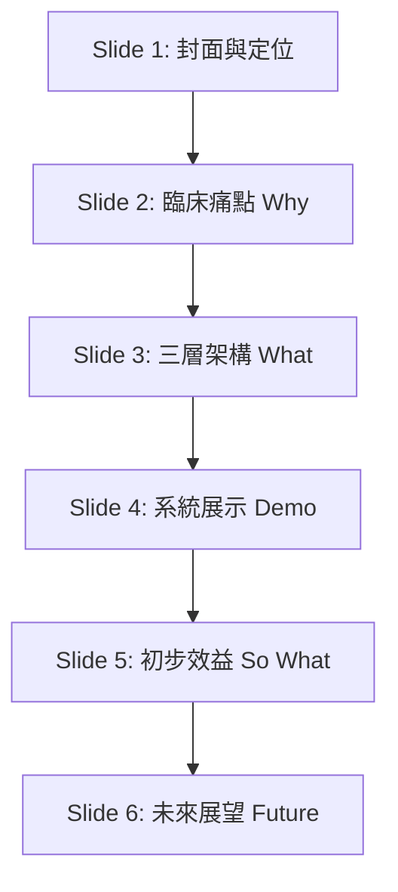

# 脊椎術後追蹤系統 ｜ 報告主講人指引（劉主任版）

本指引專為骨科部**劉主任**向醫院外科部長進行「脊椎術後追蹤系統」報告所設計。內容整合了一頁式專案摘要、5分鐘簡報逐頁導覽（Speaker Notes）以及 QA 防空洞擬答，協助主任流暢完成報告。

---

## 📌 一頁式專案摘要（Executive Summary）

### 1. 為什麼要做這個系統？（臨床痛點）
脊椎術後病人平均追蹤期長達 **12 週**，傳統依賴門診回診或電話回訪，存在三大缺口：
- **人力瓶頸**：護理師每週耗費大量人力進行電話催填，效率低落。
- **照護斷層**：病患依從性差，早期的疼痛惡化或神經症狀無法即時掌握。
- **數據孤島**：臨床資料零散記錄於紙本或個人 Excel，無法形成結構化的研究資料庫。

### 2. 系統如何解決？（三層自動化機制）
以 **LINE Bot** 作為病患端介面（零 App 安裝成本），建立三層自動化機制：
* **主動推播**：於術後第 1、3、5、7、10、14…84 天（共 17 個追蹤點）自動推播問卷。
* **結構化收集**：全程數位化收集 VAS 疼痛、ODI 功能障礙、PASS 可接受度、PGIC 改善感。
* **即時儀表板**：醫護端一眼掌握所有病患追蹤完整度、異常警示與 AI 輔助解讀。

### 3. 核心價值與效益
* **主動照護**：追蹤由被動改為主動，預期顯著提升術後 12 週的資料回收率（目標 ≥80%）。
* **學術研究**：自動累積標準化數據，直接支援 MCID、PASS 等研究級分析。
* **跨科複製**：模組化設計，可快速更換量表複製至其他外科術後追蹤場景。

### 4. 技術與資安安全性
* **去識別化**：病患隱私資料（姓名、LINE ID、病歷號）與研究資料庫存於獨立加密表，物理分離。
* **資料主權**：資料完全儲存於醫院 Google Workspace 環境，不經外部第三方伺服器，符合院內資安規範。

---

## 📊 5 分鐘簡報逐頁導覽（Speaker Notes）

### Slide 1 ｜ 封面：脊椎術後追蹤系統
* **標題**：脊椎術後追蹤系統 — 以數位工具實現主動式術後照護管理
* **報告人**：劉主任（指導：骨科部）
* **講者口訣（開場）**：
  > [!NOTE]
  > 「部長好，各位長官好。今天骨科部向大家報告『脊椎術後追蹤系統』。我們希望透過數位工具，將傳統『被動、片段』的術後照護，轉化為『主動、持續』的主動式照護管理。」

---

### Slide 2 ｜ 臨床痛點：為什麼需要這個系統？ (Why Now)
* **核心內容**：
  * **現況困境**：12週、17個追蹤點全靠人工無法落實。電話追蹤每人平均耗費護理師 `[X]` 分鐘/次。資料零散無法做跨病患比較。
  * **一句話定位**：**「我們需要一個讓病患主動回報、讓醫護即時掌握、讓數據自動累積的系統。」**
* **講者口訣（痛點切入）**：
  > [!IMPORTANT]
  > 「脊椎術後病患需要長達 12 週的密切追蹤。以前我們全靠個管師或護理師一通一通打電話催填量表，這不僅耗費大量人力（每次電話平均花費 `[X]` 分鐘），而且病患接聽率低、回報依從性差。這導致我們很難在第一時間發現病患的疼痛惡化，更無法累積結構化的臨床數據來支持科部的學術研究。因此，我們需要一個自動化的解決方案。」

---

### Slide 3 ｜ 系統架構：三層自動化架構 (What)
* **核心內容**：
  * **病患端（LINE Bot）**：自動推播問卷、Quick Reply 填答。零 App 安裝成本，病患零學習成本。
  * **後端 API（Google Apps Script）**：自動計算指標、AI 輔助解析與異常警示。
  * **醫護端（網頁儀表板）**：即時查閱、異常個案警示、確認與匯出報告。
* **講者口訣（架構說明）**：
  > [!TIP]
  > 「我們的核心架構分為三層：
  > 1. **病患端**我們選用普及率最高的 LINE Bot，病患不需要下載額外的 App，長輩也能用 Quick Reply 按鈕輕鬆填答。
  > 2. **後端 API** 採用輕量快速的 Google Apps Script，自動將病患回報的數據轉化為臨床指標，並篩選出異常數值。
  > 3. **醫護端**則有網頁儀表板，讓個管師和醫師一眼就能掌握所有病患的康復進度。」

---

### Slide 4 ｜ 介面展示：直覺式填答與管理介面 (Demo)
* **核心內容**：
  * **病患端 (LINE Quick Reply)**：快速點選 VAS/ODI，操作簡單直覺。
  * **護理師端 (回診登記中心)**：搜尋病患，即時顯示術後天數、VAS 歷史與 LINE 綁定狀態。
  * **醫師端 (Dashboard)**：包含追蹤完整度進度條、VAS 顏色警示（綠→紅）、AI 暫存確認區。
  * **強調重點**：「異常 VAS 自動標紅」、「追蹤完整度一目了然」。
* **講者口訣（畫面展示）**：
  > [!NOTE]
  > 「這張投影片展示了系統的實際畫面（劉主任可在此引導聽眾看投影片上的 Demo 或點擊畫面開啟 [線上 Demo 網頁](https://spine-cgh.pages.dev/demo) 進行展示）。
  > 畫面上我們用紅框特別標註：當病患在 LINE 上回報的 VAS 疼痛分數異常時，後端儀表板會**自動標紅警示**。個管師在回診登記中心一眼就能看到哪些病患需要優先關懷，醫師也能在門診前掌握病患 12 週的疼痛趨勢圖。」

---

### Slide 5 ｜ 初步成果與預期效益 (So What)
* **核心內容**（效益對比表）：

| 指標             | 現況 / 被動追蹤           | 系統預期效益                                   |
| :--------------- | :------------------------ | :--------------------------------------------- |
| **追蹤完整度**   | 回報不規律、片段資料      | **目標回報率 ≥ 80%**                           |
| **護理追蹤人力** | 電話催填耗費大量人力      | **電話催填工作大幅減少 (減負)**                |
| **研究資料庫**   | 紙本/個人 Excel，資料零散 | **12週結構化資料，直接支援 VAS/ODI/MCID 分析** |
| **早期警示**     | 門診回診才發現惡化        | **疼痛惡化個案門診前主動介入關懷**             |

* **講者口訣（效益說服）**：
  > [!TIP]
  > 「透過這套系統，我們預期能帶來四個核心效益：首先是**追蹤完整度**能從以前的不規律提升到 **80% 以上**；其次是大幅釋放**護理人力**，讓她們能專注在真正需要關懷的病患上；第三是自動建立結構化的**臨床研究資料庫**，直接支援 MCID 等分析；最後，也是最重要的，我們能建立**早期警示機制**，在病患疼痛惡化時主動介入。」

---

### Slide 6 ｜ 未來展望：模組化設計，跨科複製潛力 (針對部長報告)
* **核心內容**：
  * **核心亮點**：**「模組化設計，一套邏輯，跨科複製」**。核心推播與收集架構與術式無關。
  * **跨科應用**：
    * 心臟外科：CABG / 瓣膜置換術後 HRQoL 追蹤 (SF-36、KCCQ 量表)
    * 一般外科：癌症術後追蹤管理
    * 骨科：關節置換術後 (KOOS、OHS 量表)
  * **建議下一步**：以**骨科脊椎為 Pilot**，建立院內數位術後追蹤標準流程。
* **講者口訣（結尾結語）**：
  > [!IMPORTANT]
  > 「最後，這套系統最吸引人的是它的**模組化設計**。這套『定期推播 → 結構化收集 → 警示儀表板』的邏輯與術式無關。我們未來只需更換評估量表，就能快速複製到心臟外科、一般外科或骨科其他關節置換術後。
  > **因此，我建議科部下一步以骨科脊椎作為 Pilot 示範點**，優化標準流程後，逐步推廣至全院，建立院內數位術後追蹤的標準規範。謝謝部長，請部長與各位長官指導。」

---

## 🛡️ 防空洞 QA 擬答（主任防身包）

當部長或院內評審提出挑戰時，劉主任可依以下策略回答：

### Q1：會不會增加第一線護理師或醫師的臨床負擔？
* **回答核心**：**本系統是「減負」工具，而非增加工作。**
* **建議回答**：
  > 「報告部長，這套系統在設計之初，最重要的出發點就是幫臨床**『減負』**。
  > 傳統模式下，護理師每週要主動打數十通電話去催填，效率極低。現在病患透過熟悉的 LINE 主動填答，護理師**不需再主動撥打催填電話**，只需針對系統篩選出的『未填答』或『紅字警示』個案進行點對點介入。
  > 對醫師來說，所有趨勢圖都在儀表板一頁呈現，門診時一眼就能掌握病患 12 週的狀況，不需要再去翻閱紙本量表，實際上是幫臨床節省了時間。」

### Q2：資安與病患隱私如何保障？院外傳輸安全嗎？
* **回答核心**：**物理隔離 + 去識別化 + 醫院 Workspace 原生存儲。**
* **建議回答**：
  > 「報告部長，資安與病患隱私是我們最重視的環節。系統採用**雙層物理隔離**設計：
  > 1. 病患的個人識別資料（如姓名、病歷號、LINE ID）儲存在獨立且加密的對照表中。
  > 2. 後端研究與分析資料庫完全使用**『去識別化』的隨機研究編號**，兩者物理分離。
  > 此外，系統的資料主權完全保留在**醫院自有的 Google Workspace 環境**中，不經過任何外部第三方公司的伺服器。這符合醫院對資安與病人隱私保護的最高規範。」

### Q3：這個系統未來能跟醫院的 HIS（醫療資訊系統）整合嗎？
* **回答核心**：**已預留標準 API，具備無縫對接能力，目前輕量部署優先。**
* **建議回答**：
  > 「報告部長，完全可以。目前系統為了達到**『快速部署、彈性調整』**的目的，先採用了輕量化的獨立架構，但後端已經建立了標準化的 API 介面。
  > 未來如果與院內資訊室（IT）合作，技術上完全具備對接 HIS 的能力。例如，病患的手術日期、術式等基本資料，可以直接從 HIS 自動帶入系統，病患的評估報告也可以直接自動上傳回傳至 HIS 病歷系統，讓流程更自動化。」

### Q4：這跟院外現成的商業系統相比，有什麼優勢？
* **回答核心**：**資料自主權 + 零授權費 + 臨床主導客製化。**
* **建議回答**：
  > 「報告部長，主要有三個核心優勢：
  > 1. **資料自主權**：商業系統通常是黑盒子，數據存在廠商端，院方難以自由運用進行學術研究；本系統資料庫在院方環境，我們擁有 100% 的數據主權。
  > 2. **建置與維護成本**：商業系統的授權費與維護費通常高昂；本系統完全自主開發，後續維護成本幾乎為零。
  > 3. **臨床契合度**：這是真正由第一線骨科臨床醫師主導、針對本院醫療流程與病患特性客製化的工具，比一般商業公版系統更貼合我們的臨床需求。」